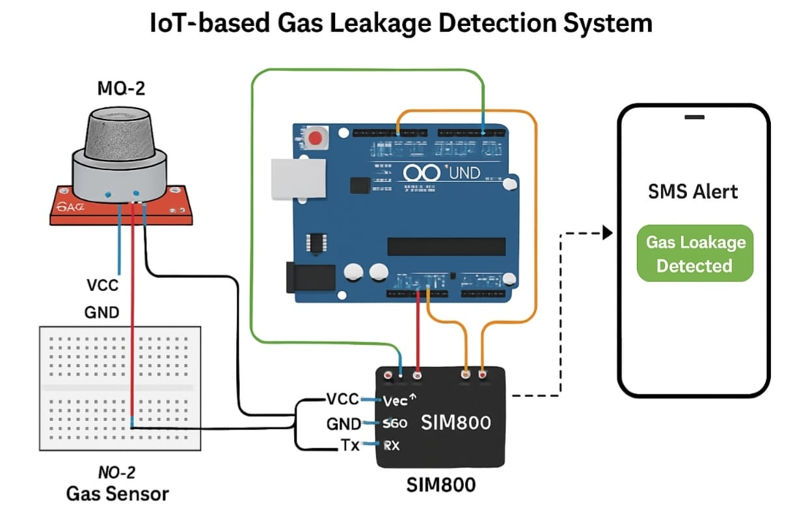
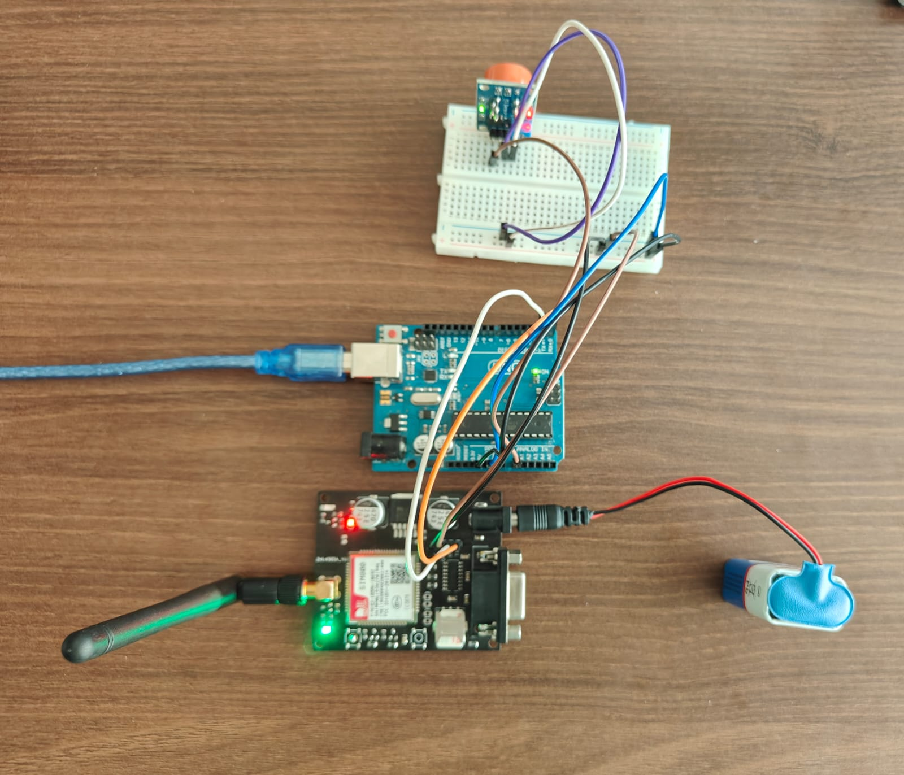

# IoT Gas Leakage Detection System 🚨

An IoT-based solution for detecting gas leaks using ESP32, MQ gas sensor, buzzer, and LED. 
The system sends real-time alerts over MQTT to enable remote monitoring.

## Features
- Detects gas leakage in real time
- Buzzer + LED alert when gas level crosses threshold
- Sends data to MQTT broker for dashboards

## Components
- ESP32
- MQ-2 (or MQ-135) gas sensor
- Buzzer
- LED
- Resistors, jumper wires

## Circuit Diagram

  

## Project Images

  

  

  

## Setup
1. Clone this repository.
2. Open the code in Arduino IDE.
3. Update Wi-Fi and MQTT credentials in the code.
4. Upload to ESP32.

